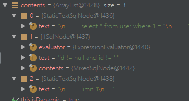

1、Mybatis动态sql是做什么的？都有哪些动态sql？简述一下动态sql的执行原理？
动态SQL是为了满足在不同条件下对SQL语句的不同条件的正确语法拼接。以下是Mybatis之动态SQL的元素种类：
1.if
2.choose(when,otherwise)
3.trim(where,set)
4.foreach
在初始化Mybatis配置时，以以下代码为例：
```
<select id="findById">
        select * from user where 1 = 1
        <if test="id != null and id != ''">
            and id=#{id}
        </if>
        limit 1
    </select>
```
当我们加载Mybatis配置文件时，比如：
```
InputStream resourceAsStream = Resources.getResourceAsStream("SqlMapConfig.xml");
SqlSessionFactory sqlSessionFactory = new SqlSessionFactoryBuilder().build(resourceAsStream);
```
在
```
org.apache.ibatis.builder.xml.XMLMapperBuilder#configurationElement
```
方法中
```
private void configurationElement(XNode context) {
        try {
            String namespace = context.getStringAttribute("namespace");
            if (namespace != null && !namespace.equals("")) {
                this.builderAssistant.setCurrentNamespace(namespace);
                this.cacheRefElement(context.evalNode("cache-ref"));
                this.cacheElement(context.evalNode("cache"));
                this.parameterMapElement(context.evalNodes("/mapper/parameterMap"));
                this.resultMapElements(context.evalNodes("/mapper/resultMap"));
                this.sqlElement(context.evalNodes("/mapper/sql"));
                this.buildStatementFromContext(context.evalNodes("select|insert|update|delete"));
            } else {
                throw new BuilderException("Mapper's namespace cannot be empty");
            }
        } catch (Exception var3) {
            throw new BuilderException("Error parsing Mapper XML. Cause: " + var3, var3);
        }
    }
```
这里以初始化时的select标签为例
```
private void buildStatementFromContext(List<XNode> list) {
        if (this.configuration.getDatabaseId() != null) {
            this.buildStatementFromContext(list, this.configuration.getDatabaseId());
        }
        this.buildStatementFromContext(list, (String)null);
    }
```
```
private void buildStatementFromContext(List<XNode> list, String requiredDatabaseId) {
        Iterator var3 = list.iterator();
        while(var3.hasNext()) {
            XNode context = (XNode)var3.next();
            XMLStatementBuilder statementParser = new XMLStatementBuilder(this.configuration, this.builderAssistant, context, requiredDatabaseId);
            try {
                statementParser.parseStatementNode();
            } catch (IncompleteElementException var7) {
                this.configuration.addIncompleteStatement(statementParser);
            }
        }
    }
```
这里的while循环会对整个Mapper文件的select|insert|update|delete所有节点进行遍历处理，继续查看
```
org.apache.ibatis.builder.xml.XMLStatementBuilder#parseStatementNode
```
```
public void parseStatementNode() {
        String id = this.context.getStringAttribute("id");
        String databaseId = this.context.getStringAttribute("databaseId");
        if (this.databaseIdMatchesCurrent(id, databaseId, this.requiredDatabaseId)) {
            ...省略
            String lang = this.context.getStringAttribute("lang");
            LanguageDriver langDriver = this.getLanguageDriver(lang);
            ....省略
            SqlSource sqlSource = langDriver.createSqlSource(this.configuration, this.context, parameterTypeClass);
			....省略
            this.builderAssistant.addMappedStatement(id, sqlSource, statementType, sqlCommandType, fetchSize, timeout, parameterMap, parameterTypeClass, resultMap, resultTypeClass, resultSetTypeEnum, flushCache, useCache, resultOrdered, (KeyGenerator)keyGenerator, keyProperty, keyColumn, databaseId, langDriver, resultSets);
        }
    }
```
这里我们并没有lang参数，所以会使用默认的XMLLanguageDriver。
```
public SqlSource createSqlSource(Configuration configuration, XNode script, Class<?> parameterType) {
        XMLScriptBuilder builder = new XMLScriptBuilder(configuration, script, parameterType);
        return builder.parseScriptNode();
}
```
```
org.apache.ibatis.scripting.xmltags.XMLScriptBuilder#parseScriptNode
```
```
public SqlSource parseScriptNode() {
        List<SqlNode> contents = this.parseDynamicTags(this.context);
        MixedSqlNode rootSqlNode = new MixedSqlNode(contents);
        SqlSource sqlSource = null;
        if (this.isDynamic) {
            sqlSource = new DynamicSqlSource(this.configuration, rootSqlNode);
        } else {
            sqlSource = new RawSqlSource(this.configuration, rootSqlNode, this.parameterType);
        }
        return (SqlSource)sqlSource;
    }
```
其中List<SqlNode>的返回内容如下图：

```
这里尤其需要注意第二个Node节点的实现类为IfSqlNode。
org.apache.ibatis.scripting.xmltags.XMLScriptBuilder#parseDynamicTags在上面的动态SQL配置下会返回一个DynamicSqlSource对象，该对象最终会被设置到MappedStatement对象中。
至此动态SQL的解析完成。
```
接下来我们查看查询是生成Statement时的代码逻辑：
我们从
```
org.apache.ibatis.executor.BaseExecutor#query(org.apache.ibatis.mapping.MappedStatement, java.lang.Object, org.apache.ibatis.session.RowBounds, org.apache.ibatis.session.ResultHandler)这个方法签名入手
```
```
public <E> List<E> query(MappedStatement ms, Object parameter, RowBounds rowBounds, ResultHandler resultHandler) throws SQLException {
        BoundSql boundSql = ms.getBoundSql(parameter);
        CacheKey key = this.createCacheKey(ms, parameter, rowBounds, boundSql);
        return this.query(ms, parameter, rowBounds, resultHandler, key, boundSql);
    }
```
```
org.apache.ibatis.mapping.MappedStatement#getBoundSql
```
```
public BoundSql getBoundSql(Object parameterObject) {
        BoundSql boundSql = this.sqlSource.getBoundSql(parameterObject);
        List<ParameterMapping> parameterMappings = boundSql.getParameterMappings();
        if (parameterMappings == null || parameterMappings.isEmpty()) {
            boundSql = new BoundSql(this.configuration, boundSql.getSql(), this.parameterMap.getParameterMappings(), parameterObject);
        }

        Iterator var4 = boundSql.getParameterMappings().iterator();

        while(var4.hasNext()) {
            ParameterMapping pm = (ParameterMapping)var4.next();
            String rmId = pm.getResultMapId();
            if (rmId != null) {
                ResultMap rm = this.configuration.getResultMap(rmId);
                if (rm != null) {
                    this.hasNestedResultMaps |= rm.hasNestedResultMaps();
                }
            }
        }

        return boundSql;
    }
```
这里的sqlSource对象其实就是解析时，产生的DynamicSqlSource。
```
public BoundSql getBoundSql(Object parameterObject) {
        DynamicContext context = new DynamicContext(this.configuration, parameterObject);
        this.rootSqlNode.apply(context);
        SqlSourceBuilder sqlSourceParser = new SqlSourceBuilder(this.configuration);
        Class<?> parameterType = parameterObject == null ? Object.class : parameterObject.getClass();
        SqlSource sqlSource = sqlSourceParser.parse(context.getSql(), parameterType, context.getBindings());
        BoundSql boundSql = sqlSource.getBoundSql(parameterObject);
        Iterator var7 = context.getBindings().entrySet().iterator();
        while(var7.hasNext()) {
            Entry<String, Object> entry = (Entry)var7.next();
            boundSql.setAdditionalParameter((String)entry.getKey(), entry.getValue());
        }
        return boundSql;
    }
```
这里由于rootSqlNode是一个MixedSqlNode对象，所以我们直接跳到该方法：
```
public boolean apply(DynamicContext context) {
        Iterator var2 = this.contents.iterator();

        while(var2.hasNext()) {
            SqlNode sqlNode = (SqlNode)var2.next();
            sqlNode.apply(context);
        }
        return true;
    }
```
由于我们初始化的时候只写了一个if标签，所以直接查看IfSqlNode实现类的apply方法：
```
public boolean apply(DynamicContext context) {
        if (this.evaluator.evaluateBoolean(this.test, context.getBindings())) {
            this.contents.apply(context);
            return true;
        } else {
            return false;
        }
    }
```
这里默认使用了ExpressionEvaluator实现类的evaluateBoolean方法，使用OGNL处理表达式逻辑，如果满足条件就会把SQL追加进去，至此整个循环结束会根据条件产生一个完整的带执行的SQL语句，接下来就是设置参数并执行。
2、Mybatis是否支持延迟加载？如果支持，它的实现原理是什么？
Mybatis支持一对一、一对多的延迟加载，实现原理是通过DefaultResultSetHandler通过Javassist或者Cglib创建动态代理对象实现，拦截到指定执行方法时，再去执行数据加载(源码没怎么看懂)。
3、Mybatis都有哪些Executor执行器？它们之间的区别是什么？
```
在org.apache.ibatis.session.Configuration#newExecutor(org.apache.ibatis.transaction.Transaction, org.apache.ibatis.session.ExecutorType)方法中可以看到有以下Executor。
```
```
public Executor newExecutor(Transaction transaction, ExecutorType executorType) {
        executorType = executorType == null ? this.defaultExecutorType : executorType;
        executorType = executorType == null ? ExecutorType.SIMPLE : executorType;
        Object executor;
        if (ExecutorType.BATCH == executorType) {
            executor = new BatchExecutor(this, transaction);
        } else if (ExecutorType.REUSE == executorType) {
            executor = new ReuseExecutor(this, transaction);
        } else {
            executor = new SimpleExecutor(this, transaction);
        }
        if (this.cacheEnabled) {
            executor = new CachingExecutor((Executor)executor);
        }
        Executor executor = (Executor)this.interceptorChain.pluginAll(executor);
        return executor;
    }
```
1. BatchExecutor  批处理执行器。
2. ReuseExecutor 可重用Statement执行器。
3. SimpleExecutor 默认的执行器。
4. CachingExecutor 缓存执行器，先从缓存中查询结果，如果存在，就直接返回；反之去数据库查询。

4、简述下Mybatis的一级、二级缓存（分别从存储结构、范围、失效场景。三个方面来作答）？
一级缓存：SqlSession级别，SqlSession对象会有一个Executor对象，每个Executor对象中有一个PerpetualCache对象用于缓存，底层数据结构是HashMap。默认一级缓存是开启的，在SqlSession会话结束时(close)会释放掉缓存,在同一个SqlSession有update、delete、insert等操作时，会根据CacheKey的条件来使缓存失效。
二级缓存：基于Mapper文件namespace级别，多个SqlSession是可以共享缓存的，针对Mapper文件insert、update和delete语句会导致二级缓存被清空。
一级、二级缓存的行为可以通过flushCache、useCache进行修改。二级缓存在分布式环境下容易产生脏读。
5、简述Mybatis的插件运行原理，以及如何编写一个插件？
1. 实现org.apache.ibatis.plugin.Interceptor接口，并实现三个抽象方法
2. 对@Intercepts拦截方法进行配置
3. 将插件配置到SqlMapper.xml文件 
```
<plugins>
        <plugin interceptor="com.mar.plugin.MyPlugin">
            <property name="name" value="chengdu"/>
        </plugin>
    </plugins>
```
4.正常执行SQL查询就能看到自定义插件生效。

在Mybatis中创建Executor、StatementHandler、ResultSetHandler、ParameterHandler对象时，都不是直接返回的该类实例，而是返回的代理对象。
```
org.apache.ibatis.plugin.InterceptorChain#pluginAll
```
```
public Object pluginAll(Object target) {
        Interceptor interceptor;
        for(Iterator var2 = this.interceptors.iterator(); var2.hasNext(); target = interceptor.plugin(target)) {
            interceptor = (Interceptor)var2.next();
        }
        return target;
    }
```
其中target对象就是上述四个类的实例对象，此时其实返回的实例对象的代理类，
Plugin实现了InvocationHandler接口，因此在在对其对象的方法调用时，实际是调用的invoke方法。
```
org.apache.ibatis.plugin.Plugin#invoke
```
```
public Object invoke(Object proxy, Method method, Object[] args) throws Throwable {
        try {
            Set<Method> methods = (Set)this.signatureMap.get(method.getDeclaringClass());
            return methods != null && methods.contains(method) ? this.interceptor.intercept(new Invocation(this.target, method, args)) : method.invoke(this.target, args);
        } catch (Exception var5) {
            throw ExceptionUtil.unwrapThrowable(var5);
        }
    }
```
这里会检查被拦截方法是否配置在@Signature拦截方法中，若是，则执行拦截方法，因此在插件拦截方法里可以完成其他操作；否则执行被代理方法。